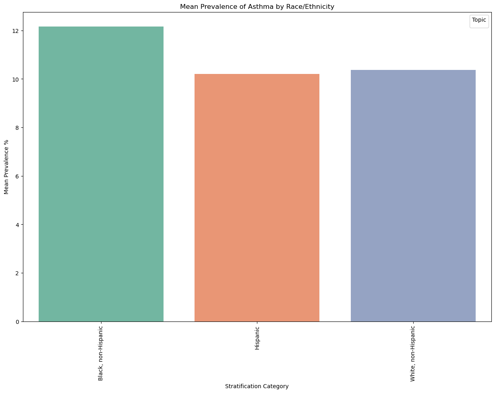
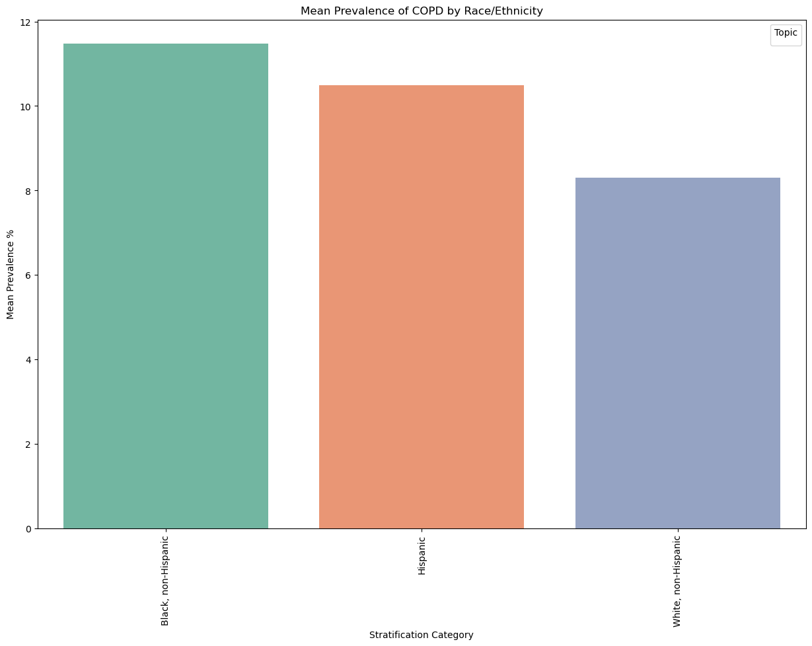

# Research Question
Peter Gansallo
Assignment 2

## Does the prevalence of asthma and Chronic Obstructive Pulmonary Disease (COPD) vary by race in the united states?
# Problem Statement

The prevalence of asthma and Chronic Obstructive Pulmonary Disease (COPD) presents significant public health concerns in the United States, with variations observed across different states. While my initial analysis in Assignment 1 aimed to find geographic disparities in these respiratory conditions, our findings revealed that population size, rather than geography, was the primary factor influencing prevalence across states. Given this result, our focus now shifts to examining racial demographics to determine whether certain racial groups are disproportionately affected by asthma and COPD, offering a new perspective on potential disparities.
# Data Description:

United States Chronic Disease Indicators (CDI)
Last Updated: March 9, 2024
Source: CDC's Division of Population Health

The U.S. Chronic Disease Indicators dataset provides a set of 115 public health indicators developed through a collaborative effort involving the CDC, the Council of State and Territorial Epidemiologists, and the National Association of Chronic Disease Directors. These indicators enable consistent collection, reporting, and analysis of chronic disease data at the state and territorial levels. The dataset is designed to support public health practice, offering state-specific data while serving as a gateway to additional health-related data and resources.

The dataset is publicly accessible and available in multiple formats, including CSV, RDF, JSON, and XML, and I'll be accessing the CSV dataset that's available.

# Code
## Examine the dataset
Describe Methodology. Load the Dataset, check the data types, see the missing values, drop the columns are empty, make an analysis of the data
### Import libraries


```python
# Import the libraries
import numpy as np                  # Numerical Python
import pandas as pd                 # Data Analysis
import matplotlib.pyplot as plt     # Plotting
import seaborn as sns               # Statistical Data Visualization

# Let's make sure pandas returns all the rows and columns for the dataframe
pd.set_option('display.max_rows', None)
pd.set_option('display.max_columns', None)

# Force pandas to display full numbers instead of scientific notation
#pd.options.display.float_format = '{:.0f}'.format

# Library to suppress warnings
import warnings
warnings.filterwarnings('ignore')
```

## Read the dataset


```python
# Read the dataset
df = pd.read_csv('U.S._Chronic_Disease_Indicators.csv')
```

## Cleaning And Understanding The Data


```python
# Checking first elements of the DataFrame with `.head( )` method
df.head()
```


<div>
<table border="1" class="dataframe">
  <thead>
    <tr style="text-align: right;">
      <th></th>
      <th>YearStart</th>
      <th>YearEnd</th>
      <th>LocationAbbr</th>
      <th>LocationDesc</th>
      <th>DataSource</th>
      <th>Topic</th>
      <th>Question</th>
      <th>Response</th>
      <th>DataValueUnit</th>
      <th>DataValueType</th>
      <th>DataValue</th>
      <th>DataValueAlt</th>
      <th>DataValueFootnoteSymbol</th>
      <th>DataValueFootnote</th>
      <th>LowConfidenceLimit</th>
      <th>HighConfidenceLimit</th>
      <th>StratificationCategory1</th>
      <th>Stratification1</th>
      <th>StratificationCategory2</th>
      <th>Stratification2</th>
      <th>StratificationCategory3</th>
      <th>Stratification3</th>
      <th>Geolocation</th>
      <th>LocationID</th>
      <th>TopicID</th>
      <th>QuestionID</th>
      <th>ResponseID</th>
      <th>DataValueTypeID</th>
      <th>StratificationCategoryID1</th>
      <th>StratificationID1</th>
      <th>StratificationCategoryID2</th>
      <th>StratificationID2</th>
      <th>StratificationCategoryID3</th>
      <th>StratificationID3</th>
    </tr>
  </thead>
  <tbody>
    <tr>
      <th>0</th>
      <td>2015</td>
      <td>2019</td>
      <td>US</td>
      <td>United States</td>
      <td>US Cancer DVT</td>
      <td>Cancer</td>
      <td>Breast cancer mortality among all females, und...</td>
      <td>NaN</td>
      <td>Number</td>
      <td>Number</td>
      <td>3009.0</td>
      <td>3009.0</td>
      <td>NaN</td>
      <td>NaN</td>
      <td>NaN</td>
      <td>NaN</td>
      <td>Race/Ethnicity</td>
      <td>Hispanic</td>
      <td>NaN</td>
      <td>NaN</td>
      <td>NaN</td>
      <td>NaN</td>
      <td>NaN</td>
      <td>59</td>
      <td>CAN</td>
      <td>CAN02</td>
      <td>NaN</td>
      <td>NMBR</td>
      <td>RACE</td>
      <td>HIS</td>
      <td>NaN</td>
      <td>NaN</td>
      <td>NaN</td>
      <td>NaN</td>
    </tr>
    <tr>
      <th>1</th>
      <td>2019</td>
      <td>2019</td>
      <td>GU</td>
      <td>Guam</td>
      <td>BRFSS</td>
      <td>Diabetes</td>
      <td>Diabetes among adults</td>
      <td>NaN</td>
      <td>%</td>
      <td>Crude Prevalence</td>
      <td>19.3</td>
      <td>19.3</td>
      <td>NaN</td>
      <td>NaN</td>
      <td>15.8</td>
      <td>23.5</td>
      <td>Age</td>
      <td>Age 45-64</td>
      <td>NaN</td>
      <td>NaN</td>
      <td>NaN</td>
      <td>NaN</td>
      <td>POINT (144.793731 13.444304)</td>
      <td>66</td>
      <td>DIA</td>
      <td>DIA01</td>
      <td>NaN</td>
      <td>CRDPREV</td>
      <td>AGE</td>
      <td>AGE4564</td>
      <td>NaN</td>
      <td>NaN</td>
      <td>NaN</td>
      <td>NaN</td>
    </tr>
    <tr>
      <th>2</th>
      <td>2019</td>
      <td>2019</td>
      <td>ID</td>
      <td>Idaho</td>
      <td>BRFSS</td>
      <td>Diabetes</td>
      <td>Diabetes among adults</td>
      <td>NaN</td>
      <td>%</td>
      <td>Crude Prevalence</td>
      <td>10.6</td>
      <td>10.6</td>
      <td>NaN</td>
      <td>NaN</td>
      <td>9.1</td>
      <td>12.2</td>
      <td>Sex</td>
      <td>Male</td>
      <td>NaN</td>
      <td>NaN</td>
      <td>NaN</td>
      <td>NaN</td>
      <td>POINT (-114.3637300419997 43.682630005000476)</td>
      <td>16</td>
      <td>DIA</td>
      <td>DIA01</td>
      <td>NaN</td>
      <td>CRDPREV</td>
      <td>SEX</td>
      <td>SEXM</td>
      <td>NaN</td>
      <td>NaN</td>
      <td>NaN</td>
      <td>NaN</td>
    </tr>
    <tr>
      <th>3</th>
      <td>2019</td>
      <td>2019</td>
      <td>MD</td>
      <td>Maryland</td>
      <td>BRFSS</td>
      <td>Mental Health</td>
      <td>Depression among adults</td>
      <td>NaN</td>
      <td>%</td>
      <td>Crude Prevalence</td>
      <td>12.1</td>
      <td>12.1</td>
      <td>NaN</td>
      <td>NaN</td>
      <td>11.0</td>
      <td>13.3</td>
      <td>Sex</td>
      <td>Male</td>
      <td>NaN</td>
      <td>NaN</td>
      <td>NaN</td>
      <td>NaN</td>
      <td>POINT (-76.60926011099963 39.29058096400047)</td>
      <td>24</td>
      <td>MEN</td>
      <td>MEN02</td>
      <td>NaN</td>
      <td>CRDPREV</td>
      <td>SEX</td>
      <td>SEXM</td>
      <td>NaN</td>
      <td>NaN</td>
      <td>NaN</td>
      <td>NaN</td>
    </tr>
    <tr>
      <th>4</th>
      <td>2019</td>
      <td>2019</td>
      <td>MI</td>
      <td>Michigan</td>
      <td>NVSS</td>
      <td>Health Status</td>
      <td>Life expectancy at birth</td>
      <td>NaN</td>
      <td>Years</td>
      <td>Number</td>
      <td>78.0</td>
      <td>78.0</td>
      <td>NaN</td>
      <td>NaN</td>
      <td>77.9</td>
      <td>78.1</td>
      <td>Overall</td>
      <td>Overall</td>
      <td>NaN</td>
      <td>NaN</td>
      <td>NaN</td>
      <td>NaN</td>
      <td>POINT (-84.71439026999968 44.6613195430005)</td>
      <td>26</td>
      <td>HEA</td>
      <td>HEA06</td>
      <td>NaN</td>
      <td>NMBR</td>
      <td>OVERALL</td>
      <td>OVR</td>
      <td>NaN</td>
      <td>NaN</td>
      <td>NaN</td>
      <td>NaN</td>
    </tr>
  </tbody>
</table>
</div>


```python
# display the dimensions of the data
# This is the number of rows and columns in the data
# Syntax: DataFrame.shape
df.shape
```


    (310480, 34)


```python
# Let's check the basic information about the dataset
# Syntax: DataFrame.info()
df.info()
```

    <class 'pandas.core.frame.DataFrame'>
    RangeIndex: 310480 entries, 0 to 310479
    Data columns (total 34 columns):
     #   Column                     Non-Null Count   Dtype  
    ---  ------                     --------------   -----  
     0   YearStart                  310480 non-null  int64  
     1   YearEnd                    310480 non-null  int64  
     2   LocationAbbr               310480 non-null  object 
     3   LocationDesc               310480 non-null  object 
     4   DataSource                 310480 non-null  object 
     5   Topic                      310480 non-null  object 
     6   Question                   310480 non-null  object 
     7   Response                   0 non-null       float64
     8   DataValueUnit              310480 non-null  object 
     9   DataValueType              310480 non-null  object 
     10  DataValue                  209826 non-null  float64
     11  DataValueAlt               209826 non-null  float64
     12  DataValueFootnoteSymbol    102351 non-null  object 
     13  DataValueFootnote          102351 non-null  object 
     14  LowConfidenceLimit         189515 non-null  float64
     15  HighConfidenceLimit        189520 non-null  float64
     16  StratificationCategory1    310480 non-null  object 
     17  Stratification1            310480 non-null  object 
     18  StratificationCategory2    0 non-null       float64
     19  Stratification2            0 non-null       float64
     20  StratificationCategory3    0 non-null       float64
     21  Stratification3            0 non-null       float64
     22  Geolocation                304694 non-null  object 
     23  LocationID                 310480 non-null  int64  
     24  TopicID                    310480 non-null  object 
     25  QuestionID                 310480 non-null  object 
     26  ResponseID                 0 non-null       float64
     27  DataValueTypeID            310480 non-null  object 
     28  StratificationCategoryID1  310480 non-null  object 
     29  StratificationID1          310480 non-null  object 
     30  StratificationCategoryID2  0 non-null       float64
     31  StratificationID2          0 non-null       float64
     32  StratificationCategoryID3  0 non-null       float64
     33  StratificationID3          0 non-null       float64
    dtypes: float64(14), int64(3), object(17)
    memory usage: 80.5+ MB


```python
#create a function that removes empty columns, and tells us the columns that were empty and removed
def empty_columns(DataFrame):
    for column in DataFrame.columns:
        if len(DataFrame[column].dropna()) == 0:
            #column has only empty rows, so we don't need this column
            DataFrame.drop(columns=[column], inplace=True)
            print(str(column)+ ' was dropped from dataframe because column has only empty rows')
    print("There are " + str(len(DataFrame.columns))+ " to after dropping empty columns")
    return

empty_columns(df)
```

    Response was dropped from dataframe because column has only empty rows
    StratificationCategory2 was dropped from dataframe because column has only empty rows
    Stratification2 was dropped from dataframe because column has only empty rows
    StratificationCategory3 was dropped from dataframe because column has only empty rows
    Stratification3 was dropped from dataframe because column has only empty rows
    ResponseID was dropped from dataframe because column has only empty rows
    StratificationCategoryID2 was dropped from dataframe because column has only empty rows
    StratificationID2 was dropped from dataframe because column has only empty rows
    StratificationCategoryID3 was dropped from dataframe because column has only empty rows
    StratificationID3 was dropped from dataframe because column has only empty rows
    There are 24 to after dropping empty columns


```python
#Drop more unnecessary columns
df.drop(columns=['DataValueAlt', 'DataValueFootnoteSymbol', 'DataValueFootnote', 'LowConfidenceLimit', 'HighConfidenceLimit'],inplace=True)

```

## Filtering and cleaning the Asthma and COPD Data


```python
# Filter for only 'Asthma' and 'Chronic Obstructive Pulmonary Disease' topics
df_filtered_asthma = df[df['Topic'].isin(['Asthma'])]
```


```python
# Filter for only 'Asthma' and 'Chronic Obstructive Pulmonary Disease' topics
df_filtered_copd = df[df['Topic'].isin(['Chronic Obstructive Pulmonary Disease'])]
```


```python
# Let's create a function to determine the percentage of missing values
# Typically less than five percent missing values may not affect the results
# More than 5% can be dropped, replaced with existing data, or imputed using mean or median.

def missing(DataFrame):
    print ('Percentage of missing values in the dataset:\n',
           round((DataFrame.isnull().sum() * 100/ len(DataFrame)),2).sort_values(ascending=False))


# Call the function and execute
missing(df_filtered_asthma)
```

    Percentage of missing values in the dataset:
     DataValue                    50.23
    Geolocation                   1.87
    StratificationCategory1       0.00
    StratificationCategoryID1     0.00
    DataValueTypeID               0.00
    QuestionID                    0.00
    TopicID                       0.00
    LocationID                    0.00
    Stratification1               0.00
    YearStart                     0.00
    YearEnd                       0.00
    DataValueType                 0.00
    DataValueUnit                 0.00
    Question                      0.00
    Topic                         0.00
    DataSource                    0.00
    LocationDesc                  0.00
    LocationAbbr                  0.00
    StratificationID1             0.00
    dtype: float64


```python
missing(df_filtered_copd)
```

    Percentage of missing values in the dataset:
     DataValue                    32.78
    Geolocation                   1.89
    StratificationCategory1       0.00
    StratificationCategoryID1     0.00
    DataValueTypeID               0.00
    QuestionID                    0.00
    TopicID                       0.00
    LocationID                    0.00
    Stratification1               0.00
    YearStart                     0.00
    YearEnd                       0.00
    DataValueType                 0.00
    DataValueUnit                 0.00
    Question                      0.00
    Topic                         0.00
    DataSource                    0.00
    LocationDesc                  0.00
    LocationAbbr                  0.00
    StratificationID1             0.00
    dtype: float64


### Filtering and Cleaning Asthma


```python
# Dropping rows with missing geolocation because less than 5% missing
df_filtered_asthma = df_filtered_asthma.dropna(subset=['Geolocation'])

# Filling missing DataValue by group (DataValueUnit and DataValueType) because more than 5% missing
df_filtered_asthma['DataValue'] = df_filtered_asthma.groupby(['DataValueUnit', 'DataValueType'])['DataValue'].transform(lambda x: x.fillna(x.mean()))
```


```python
# Look at how the data now looks
df_filtered_asthma.head()
```


<div>
<table border="1" class="dataframe">
  <thead>
    <tr style="text-align: right;">
      <th></th>
      <th>YearStart</th>
      <th>YearEnd</th>
      <th>LocationAbbr</th>
      <th>LocationDesc</th>
      <th>DataSource</th>
      <th>Topic</th>
      <th>Question</th>
      <th>DataValueUnit</th>
      <th>DataValueType</th>
      <th>DataValue</th>
      <th>StratificationCategory1</th>
      <th>Stratification1</th>
      <th>Geolocation</th>
      <th>LocationID</th>
      <th>TopicID</th>
      <th>QuestionID</th>
      <th>DataValueTypeID</th>
      <th>StratificationCategoryID1</th>
      <th>StratificationID1</th>
    </tr>
  </thead>
  <tbody>
    <tr>
      <th>5</th>
      <td>2019</td>
      <td>2019</td>
      <td>MN</td>
      <td>Minnesota</td>
      <td>BRFSS</td>
      <td>Asthma</td>
      <td>Current asthma among adults</td>
      <td>%</td>
      <td>Crude Prevalence</td>
      <td>8.9</td>
      <td>Age</td>
      <td>Age 45-64</td>
      <td>POINT (-94.79420050299967 46.35564873600049)</td>
      <td>27</td>
      <td>AST</td>
      <td>AST02</td>
      <td>CRDPREV</td>
      <td>AGE</td>
      <td>AGE4564</td>
    </tr>
    <tr>
      <th>12</th>
      <td>2019</td>
      <td>2019</td>
      <td>NV</td>
      <td>Nevada</td>
      <td>BRFSS</td>
      <td>Asthma</td>
      <td>Current asthma among adults</td>
      <td>%</td>
      <td>Crude Prevalence</td>
      <td>7.1</td>
      <td>Sex</td>
      <td>Male</td>
      <td>POINT (-117.07184056399967 39.493240390000494)</td>
      <td>32</td>
      <td>AST</td>
      <td>AST02</td>
      <td>CRDPREV</td>
      <td>SEX</td>
      <td>SEXM</td>
    </tr>
    <tr>
      <th>15</th>
      <td>2019</td>
      <td>2019</td>
      <td>NJ</td>
      <td>New Jersey</td>
      <td>NVSS</td>
      <td>Asthma</td>
      <td>Asthma mortality among all people, underlying ...</td>
      <td>Number</td>
      <td>Number</td>
      <td>66.0</td>
      <td>Sex</td>
      <td>Female</td>
      <td>POINT (-74.27369128799967 40.13057004800049)</td>
      <td>34</td>
      <td>AST</td>
      <td>AST01</td>
      <td>NMBR</td>
      <td>SEX</td>
      <td>SEXF</td>
    </tr>
    <tr>
      <th>21</th>
      <td>2019</td>
      <td>2019</td>
      <td>ND</td>
      <td>North Dakota</td>
      <td>BRFSS</td>
      <td>Asthma</td>
      <td>Current asthma among adults</td>
      <td>%</td>
      <td>Crude Prevalence</td>
      <td>8.9</td>
      <td>Overall</td>
      <td>Overall</td>
      <td>POINT (-100.11842104899966 47.47531977900047)</td>
      <td>38</td>
      <td>AST</td>
      <td>AST02</td>
      <td>CRDPREV</td>
      <td>OVERALL</td>
      <td>OVR</td>
    </tr>
    <tr>
      <th>33</th>
      <td>2019</td>
      <td>2019</td>
      <td>SD</td>
      <td>South Dakota</td>
      <td>BRFSS</td>
      <td>Asthma</td>
      <td>Current asthma among adults</td>
      <td>%</td>
      <td>Crude Prevalence</td>
      <td>8.9</td>
      <td>Age</td>
      <td>Age 45-64</td>
      <td>POINT (-100.3735306369997 44.353130053000484)</td>
      <td>46</td>
      <td>AST</td>
      <td>AST02</td>
      <td>CRDPREV</td>
      <td>AGE</td>
      <td>AGE4564</td>
    </tr>
  </tbody>
</table>
</div>


```python
# List of columns I'm interested in
columns_to_keep = ['YearStart', 'YearEnd', 'Question', 'Topic', 
                   'DataValueUnit', 'DataValueType', 'DataValue', 
                   'StratificationCategory1', 'Stratification1']

# Drop the rest of the columns
df_filtered = df_filtered_asthma[columns_to_keep]
```


```python
# Look at the unique values of the interesting values I'm interested in

print(df_filtered['YearStart'].unique())
print(df_filtered['YearEnd'].unique())
print(df_filtered['Question'].unique())
print(df_filtered['DataValueUnit'].unique())
print(df_filtered['DataValueType'].unique())
```

    [2019 2020 2021 2022]
    [2019 2020 2021 2022]
    ['Current asthma among adults'
     'Asthma mortality among all people, underlying cause']
    ['%' 'Number' 'cases per 100,000']
    ['Crude Prevalence' 'Number' 'Age-adjusted Prevalence' 'Age-adjusted Rate'
     'Crude Rate']


```python
# Further filter for only 'Crude Prevalence' and race as that's what we're looking at for our investigation 
asthma = df_filtered[df_filtered['DataValueType'].isin(['Crude Prevalence'])]
asthma = asthma[asthma['StratificationCategory1'].isin(['Race/Ethnicity'])]
asthma = asthma[asthma['YearStart'].isin([2022])]
#look at the dataset again
asthma.head()
```


<div>
<table border="1" class="dataframe">
  <thead>
    <tr style="text-align: right;">
      <th></th>
      <th>YearStart</th>
      <th>YearEnd</th>
      <th>Question</th>
      <th>Topic</th>
      <th>DataValueUnit</th>
      <th>DataValueType</th>
      <th>DataValue</th>
      <th>StratificationCategory1</th>
      <th>Stratification1</th>
    </tr>
  </thead>
  <tbody>
    <tr>
      <th>261261</th>
      <td>2022</td>
      <td>2022</td>
      <td>Current asthma among adults</td>
      <td>Asthma</td>
      <td>%</td>
      <td>Crude Prevalence</td>
      <td>11.150108</td>
      <td>Race/Ethnicity</td>
      <td>Asian, non-Hispanic</td>
    </tr>
    <tr>
      <th>261338</th>
      <td>2022</td>
      <td>2022</td>
      <td>Current asthma among adults</td>
      <td>Asthma</td>
      <td>%</td>
      <td>Crude Prevalence</td>
      <td>8.700000</td>
      <td>Race/Ethnicity</td>
      <td>Hispanic</td>
    </tr>
    <tr>
      <th>261359</th>
      <td>2022</td>
      <td>2022</td>
      <td>Current asthma among adults</td>
      <td>Asthma</td>
      <td>%</td>
      <td>Crude Prevalence</td>
      <td>17.600000</td>
      <td>Race/Ethnicity</td>
      <td>Multiracial, non-Hispanic</td>
    </tr>
    <tr>
      <th>261466</th>
      <td>2022</td>
      <td>2022</td>
      <td>Current asthma among adults</td>
      <td>Asthma</td>
      <td>%</td>
      <td>Crude Prevalence</td>
      <td>11.150108</td>
      <td>Race/Ethnicity</td>
      <td>American Indian or Alaska Native, non-Hispanic</td>
    </tr>
    <tr>
      <th>261638</th>
      <td>2022</td>
      <td>2022</td>
      <td>Current asthma among adults</td>
      <td>Asthma</td>
      <td>%</td>
      <td>Crude Prevalence</td>
      <td>9.700000</td>
      <td>Race/Ethnicity</td>
      <td>White, non-Hispanic</td>
    </tr>
  </tbody>
</table>
</div>


```python
print(len(asthma['Stratification1'].unique()))
print(asthma['Stratification1'].unique())

```

    7
    ['Asian, non-Hispanic' 'Hispanic' 'Multiracial, non-Hispanic'
     'American Indian or Alaska Native, non-Hispanic' 'White, non-Hispanic'
     'Hawaiian or Pacific Islander, non-Hispanic' 'Black, non-Hispanic']


```python
#Only going to look at these three ethnicity/race

asthma = asthma[asthma['Stratification1'].isin(['Hispanic', 'Black, non-Hispanic', 'White, non-Hispanic'])]

# Because it's 54 states in this data set and where only looking at three ethnicities there should be 162 rows, 1 value for each  of the three ethnicities, so 54 * 3
asthma.info()
```

    <class 'pandas.core.frame.DataFrame'>
    Index: 162 entries, 261338 to 309943
    Data columns (total 9 columns):
     #   Column                   Non-Null Count  Dtype  
    ---  ------                   --------------  -----  
     0   YearStart                162 non-null    int64  
     1   YearEnd                  162 non-null    int64  
     2   Question                 162 non-null    object 
     3   Topic                    162 non-null    object 
     4   DataValueUnit            162 non-null    object 
     5   DataValueType            162 non-null    object 
     6   DataValue                162 non-null    float64
     7   StratificationCategory1  162 non-null    object 
     8   Stratification1          162 non-null    object 
    dtypes: float64(1), int64(2), object(6)
    memory usage: 12.7+ KB


## Do the same cleanup and filtering for COPD just like we did for ASTHMA


```python
# Dropping rows with missing geolocation because less than 5% missing
df_filtered_copd = df_filtered_copd.dropna(subset=['Geolocation'])

# Filling missing DataValue by group (DataValueUnit and DataValueType) because more than 5% missing
df_filtered_copd['DataValue'] = df_filtered_copd.groupby(['DataValueUnit', 'DataValueType'])['DataValue'].transform(lambda x: x.fillna(x.mean()))
```


```python
# List of columns I'm interested in
columns_to_keep = ['YearStart', 'YearEnd', 'Question', 'Topic', 
                   'DataValueUnit', 'DataValueType', 'DataValue', 
                   'StratificationCategory1', 'Stratification1']

# Drop the rest of the columns
df_filtered_copd = df_filtered_copd[columns_to_keep]
```


```python
print(df_filtered_copd['YearStart'].unique())
print(df_filtered_copd['YearEnd'].unique())
print(df_filtered_copd['Question'].unique())
print(df_filtered_copd['DataValueUnit'].unique())
print(df_filtered_copd['DataValueType'].unique())
```

    [2019 2020 2021 2022]
    [2019 2020 2021 2022]
    ['Hospitalization for chronic obstructive pulmonary disease as any diagnosis, Medicare-beneficiaries aged 65 years and older'
     'Chronic obstructive pulmonary disease mortality among adults aged 45 years and older, underlying cause'
     'Chronic obstructive pulmonary disease mortality among adults aged 45 years and older, underlying or contributing cause'
     'Chronic obstructive pulmonary disease among adults'
     'Current smoking among adults with chronic obstructive pulmonary disease'
     'Hospitalization for chronic obstructive pulmonary disease as principal diagnosis, Medicare-beneficiaries aged 65 years and older']
    ['Number' 'cases per 100,000' '%' 'cases per 1,000']
    ['Number' 'Crude Rate' 'Age-adjusted Rate' 'Age-adjusted Prevalence'
     'Crude Prevalence']


```python
# Further filter for only 'Crude Prevalence' and race as that's what we're looking at for our investigation 
df_filtered_copd = df_filtered_copd[df_filtered_copd['DataValueType'].isin(['Crude Prevalence'])]
df_filtered_copd = df_filtered_copd[df_filtered_copd['StratificationCategory1'].isin(['Race/Ethnicity'])]
df_filtered_copd = df_filtered_copd[df_filtered_copd['Question'].isin(['Chronic obstructive pulmonary disease among adults'])]
copd = df_filtered_copd[df_filtered_copd['YearStart'].isin([2022])]
#look at the dataset again
copd.head()
```


<div>
<table border="1" class="dataframe">
  <thead>
    <tr style="text-align: right;">
      <th></th>
      <th>YearStart</th>
      <th>YearEnd</th>
      <th>Question</th>
      <th>Topic</th>
      <th>DataValueUnit</th>
      <th>DataValueType</th>
      <th>DataValue</th>
      <th>StratificationCategory1</th>
      <th>Stratification1</th>
    </tr>
  </thead>
  <tbody>
    <tr>
      <th>260915</th>
      <td>2022</td>
      <td>2022</td>
      <td>Chronic obstructive pulmonary disease among ad...</td>
      <td>Chronic Obstructive Pulmonary Disease</td>
      <td>%</td>
      <td>Crude Prevalence</td>
      <td>18.152601</td>
      <td>Race/Ethnicity</td>
      <td>Hispanic</td>
    </tr>
    <tr>
      <th>260948</th>
      <td>2022</td>
      <td>2022</td>
      <td>Chronic obstructive pulmonary disease among ad...</td>
      <td>Chronic Obstructive Pulmonary Disease</td>
      <td>%</td>
      <td>Crude Prevalence</td>
      <td>3.300000</td>
      <td>Race/Ethnicity</td>
      <td>Hispanic</td>
    </tr>
    <tr>
      <th>261416</th>
      <td>2022</td>
      <td>2022</td>
      <td>Chronic obstructive pulmonary disease among ad...</td>
      <td>Chronic Obstructive Pulmonary Disease</td>
      <td>%</td>
      <td>Crude Prevalence</td>
      <td>18.152601</td>
      <td>Race/Ethnicity</td>
      <td>Hispanic</td>
    </tr>
    <tr>
      <th>261668</th>
      <td>2022</td>
      <td>2022</td>
      <td>Chronic obstructive pulmonary disease among ad...</td>
      <td>Chronic Obstructive Pulmonary Disease</td>
      <td>%</td>
      <td>Crude Prevalence</td>
      <td>18.152601</td>
      <td>Race/Ethnicity</td>
      <td>Multiracial, non-Hispanic</td>
    </tr>
    <tr>
      <th>261705</th>
      <td>2022</td>
      <td>2022</td>
      <td>Chronic obstructive pulmonary disease among ad...</td>
      <td>Chronic Obstructive Pulmonary Disease</td>
      <td>%</td>
      <td>Crude Prevalence</td>
      <td>18.152601</td>
      <td>Race/Ethnicity</td>
      <td>Hawaiian or Pacific Islander, non-Hispanic</td>
    </tr>
  </tbody>
</table>
</div>


```python
print(len(copd['Stratification1'].unique()))
print(copd['Stratification1'].unique())
```

    7
    ['Hispanic' 'Multiracial, non-Hispanic'
     'Hawaiian or Pacific Islander, non-Hispanic' 'Asian, non-Hispanic'
     'Black, non-Hispanic' 'American Indian or Alaska Native, non-Hispanic'
     'White, non-Hispanic']


```python
#We're only going to look at these three races
copd = copd[copd['Stratification1'].isin(['Hispanic', 'Black, non-Hispanic', 'White, non-Hispanic'])]
```


```python
# Because it's 54 states in this data set and where only looking at three ethnicities there should be 162 rows, 1 value for each  of the three ethnicities, so 54 * 3
copd.info()
```

    <class 'pandas.core.frame.DataFrame'>
    Index: 162 entries, 260915 to 310225
    Data columns (total 9 columns):
     #   Column                   Non-Null Count  Dtype  
    ---  ------                   --------------  -----  
     0   YearStart                162 non-null    int64  
     1   YearEnd                  162 non-null    int64  
     2   Question                 162 non-null    object 
     3   Topic                    162 non-null    object 
     4   DataValueUnit            162 non-null    object 
     5   DataValueType            162 non-null    object 
     6   DataValue                162 non-null    float64
     7   StratificationCategory1  162 non-null    object 
     8   Stratification1          162 non-null    object 
    dtypes: float64(1), int64(2), object(6)
    memory usage: 12.7+ KB


## Visuals of Asthma mean prevalence by race


```python
# Group by Race/Ethnicity and calculate the mean of DataValue
mean_by_race = asthma.groupby('Stratification1')['DataValue'].mean().reset_index()

mean_by_race.head()
```


<div>
<table border="1" class="dataframe">
  <thead>
    <tr style="text-align: right;">
      <th></th>
      <th>Stratification1</th>
      <th>DataValue</th>
    </tr>
  </thead>
  <tbody>
    <tr>
      <th>0</th>
      <td>Black, non-Hispanic</td>
      <td>12.158367</td>
    </tr>
    <tr>
      <th>1</th>
      <td>Hispanic</td>
      <td>10.211135</td>
    </tr>
    <tr>
      <th>2</th>
      <td>White, non-Hispanic</td>
      <td>10.363895</td>
    </tr>
  </tbody>
</table>
</div>


```python
# Group by Race/Ethnicity and calculate the mean of DataValue
mean_by_race = asthma.groupby('Stratification1')['DataValue'].mean().reset_index()
mean_by_race['Topic'] = 'Asthma'  
# Barplot to visualize the mean prevalence of Asthma and COPD by race
plt.figure(figsize=(15, 10))

sns.barplot(x='Stratification1', y='DataValue', data=mean_by_race, palette='Set2')
plt.xticks(rotation=90)
plt.title('Mean Prevalence of Asthma by Race/Ethnicity')
plt.ylabel('Mean Prevalence %')
plt.xlabel('Stratification Category')
plt.legend(title='Topic')
plt.show()

```

    No artists with labels found to put in legend.  Note that artists whose label start with an underscore are ignored when legend() is called with no argument.


    

    


## Visuals of Asthma and COPD mean prevalence by race


```python
# Group by Race/Ethnicity and calculate the mean of DataValue
mean_by_race = copd.groupby('Stratification1')['DataValue'].mean().reset_index()
mean_by_race['Topic'] = 'COPD'  
# Barplot to visualize the mean prevalence of Asthma and COPD by race
plt.figure(figsize=(15, 10))

sns.barplot(x='Stratification1', y='DataValue', data=mean_by_race, palette='Set2')
plt.xticks(rotation=90)
plt.title('Mean Prevalence of COPD by Race/Ethnicity')
plt.ylabel('Mean Prevalence %')
plt.xlabel('Stratification Category')
plt.legend(title='Topic')
plt.show()
```

    No artists with labels found to put in legend.  Note that artists whose label start with an underscore are ignored when legend() is called with no argument.


    

    


#### Use ANOVA to test for significance
sourced https://www.geeksforgeeks.org/how-to-perform-a-one-way-anova-in-python/


```python
from scipy.stats import f_oneway


# Extract groups for ANOVA for COPD
hispanic = copd[copd['Stratification1'] == 'Hispanic']['DataValue']
black = copd[copd['Stratification1'] == 'Black, non-Hispanic']['DataValue']
white = copd[copd['Stratification1'] == 'White, non-Hispanic']['DataValue']

# Perform One-Way ANOVA
f_stat, p_value = f_oneway(hispanic, black, white)

print('Statistical results for COPD')
print("ANOVA F-statistic:", f_stat)
print("ANOVA p-value:", p_value)

# Extract groups for ANOVA for Asthma
hispanic_asthma = asthma[asthma['Stratification1'] == 'Hispanic']['DataValue']
black_asthma = asthma[asthma['Stratification1'] == 'Black, non-Hispanic']['DataValue']
white_asthma = asthma[asthma['Stratification1'] == 'White, non-Hispanic']['DataValue']

print('---------------------')

# Perform One-Way ANOVA
print('Statistical results for Asthma')
f_stat, p_value = f_oneway(hispanic_asthma, black_asthma, white_asthma)
print("ANOVA F-statistic:", f_stat)
print("ANOVA p-value:", p_value)

```

    Statistical results for COPD
    ANOVA F-statistic: 4.436776879375262
    ANOVA p-value: 0.013334593720318338
    ---------------------
    Statistical results for Asthma
    ANOVA F-statistic: 11.951234863478174
    ANOVA p-value: 1.4608835061535289e-05


```python
# Perform ANOVA https://www.geeksforgeeks.org/how-to-perform-a-one-way-anova-in-python/
f_stat, p_value = f_oneway(black_group, white_group, asian_group)
print("ANOVA F-statistic:", f_stat)
print("ANOVA p-value:", p_value)
```

## Observations of the Data Set
There do seem to be slight disparities in race with COPD and Asthma in the US as in both categories Black people had noticeably higher percentages in both categories, using a ANOVA test I confirmed that there's is a relationship between race and asthma and COPD, studies have shown that people in people in certain industries were more like to get one of these conditions. One study said "an estimated 52.9% of workers in agriculture, forestry, fishing, and hunting and 42.8% of workers in manufacturing industries, as well as 61.5% of production workers, 50.8% of farming, fishing, and forestry workers, and 16.5% of adults in food preparation and serving occupations had frequent exposure to vapors, gas, dust, or fumes at work" this could mean that there is more concentration of black people in these industries causing them to have these conditions more often.\ 


